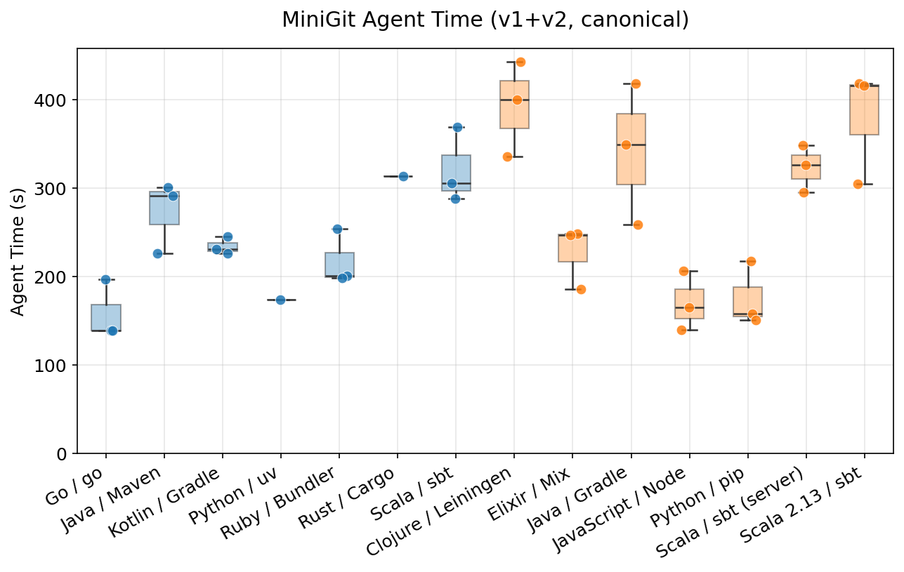
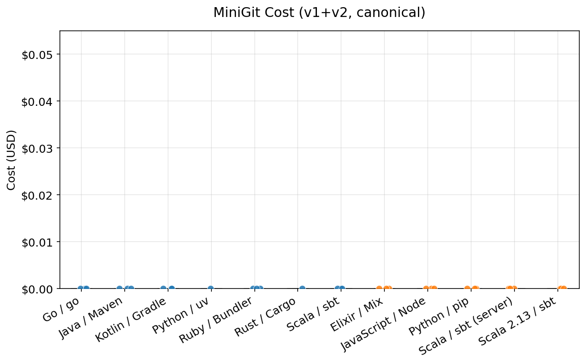
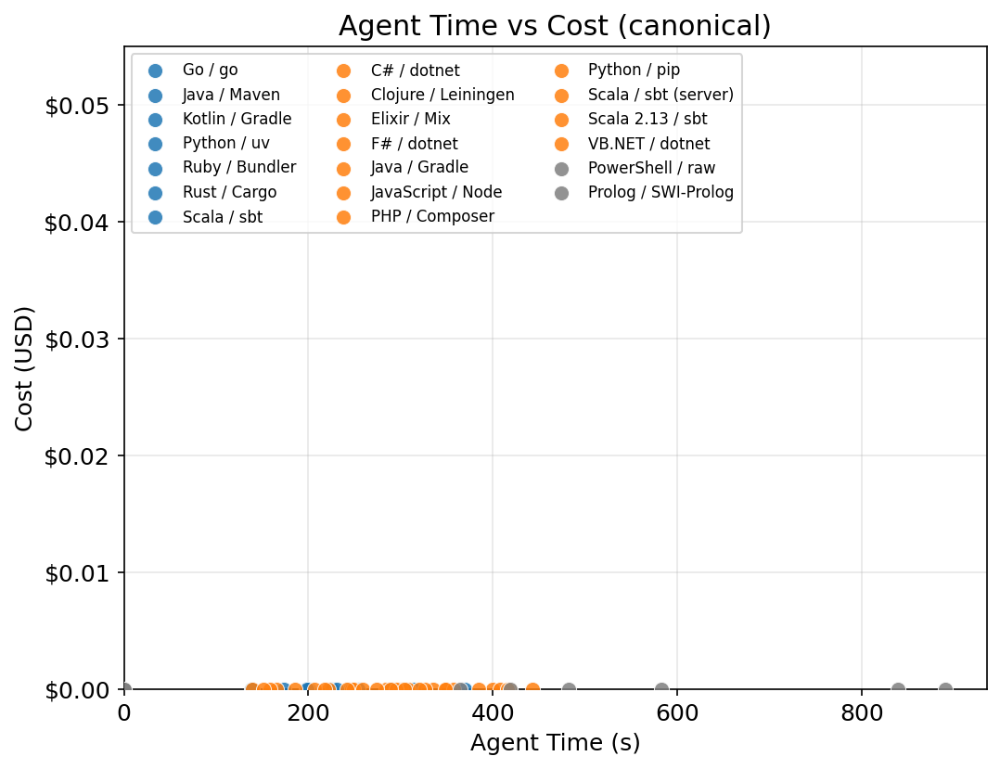
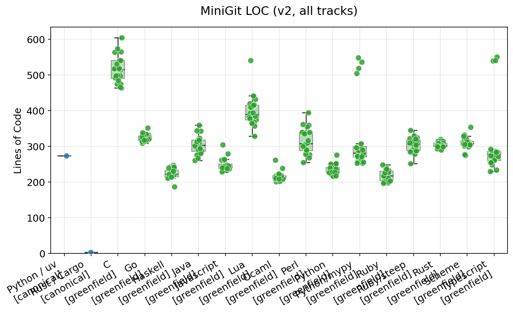
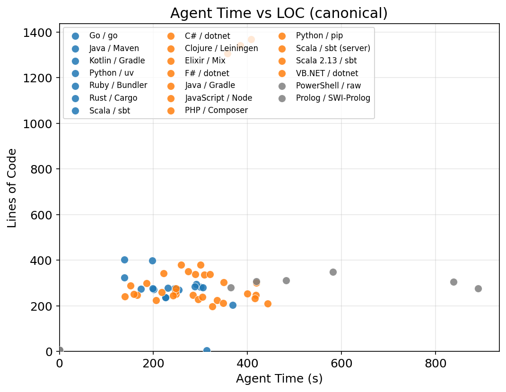
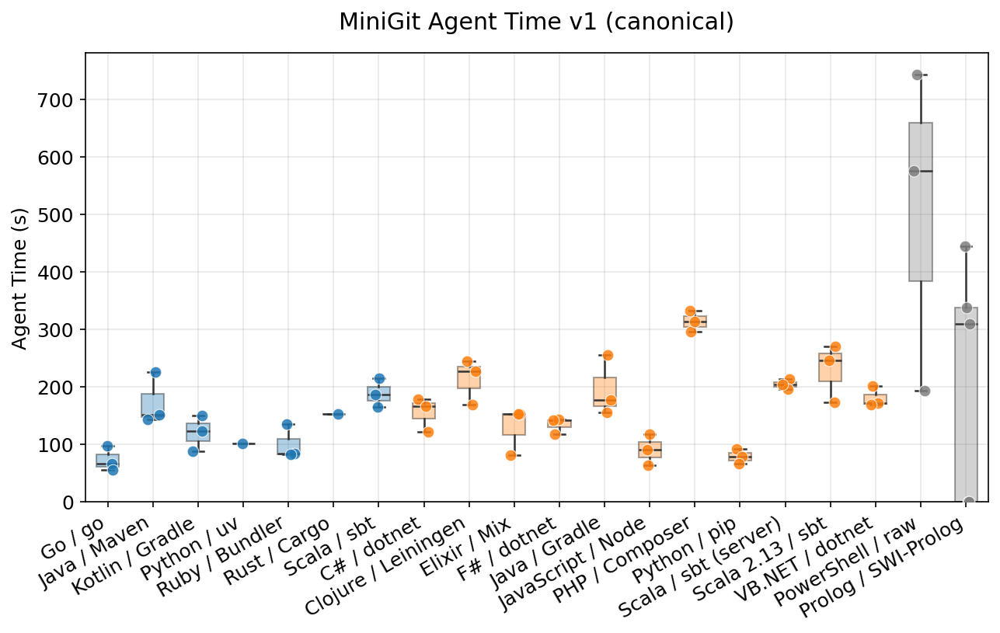
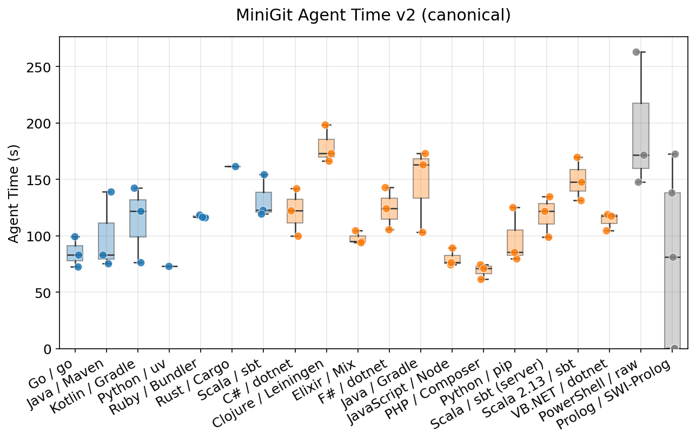

# Which Programming Language Is Best for AI Coding Agents?

A benchmark harness for comparing how efficiently [Claude Code](https://docs.anthropic.com/en/docs/claude-code) implements the same MiniGit task under different language and workflow setups.

For a detailed discussion, see the blog post: [Which Programming Language Is Best for Claude Code?](https://dev.to/mame/which-programming-language-is-best-for-claude-code-508a) / [日本語版](https://zenn.dev/mametter/articles/3e8580ec034201)

## TL;DR

The original results committed in this repository are **legacy greenfield results**: they mostly measure a mixture of bootstrap cost, tool-use structure, and implementation difficulty under a generic prompt.

This repository now distinguishes:

- **`greenfield`**: empty-directory startup cost under a generic workflow
- **`canonical`**: language-specific workflows with preselected standard tooling such as `uv`, `cargo`, `pnpm`, `maven`, `sbt`, and `gradle`

Treat the legacy tables below as exploratory data for the `greenfield` track, not as a language-level conclusion.

## Status

The committed `results/` and `figures/` still reflect the original single-track benchmark. The benchmark harness has been reworked so future runs can separate:

- language/toolchain choice
- setup cost outside the agent loop
- agent time inside the Claude loop
- primary canonical workflows vs. reference-only workflows

## Motivation

"Static typing prevents AI hallucination bugs!" vs. "Dynamic typing saves tokens!" — qualitative arguments abound, but quantitative data is scarce. This experiment aims to fill that gap.

## Benchmark Design

We ask Claude Code to implement a **mini-git** and measure time, cost, turns, and lines of code. The task is split into two phases:

The task is split into two phases:

* **v1 (New project)**: Implement `init`, `add`, `commit`, and `log`.
* **v2 (Feature extension)**: Add `status`, `diff`, `checkout`, `reset`, `rm`, and `show`.

The harness now supports two tracks:

- **`greenfield`**: start from an empty directory and use a generic prompt
- **`canonical`**: start from a benchmark-owned scaffold that fixes the toolchain entry point for each workflow

Examples of canonical workflows:

- `python/uv`
- `rust/cargo`
- `typescript/pnpm`
- `go/go`
- `java/maven`
- `ruby/bundler`
- `scala/sbt`
- `kotlin/gradle`
- `ocaml/dune`
- `haskell/cabal`

Reference-only entries such as `scheme/guile`, `perl/raw`, and `lua/raw` are retained for continuity with the original benchmark, but they should not be read as canonical ecosystem representatives.

## Legacy Greenfield Results

The table and plots below are from the original single-track benchmark. They are preserved for continuity, but they should be read as **greenfield-only** results.

### Languages

| Category | Languages |
|----------|-----------|
| Dynamic | Python, Ruby, JavaScript, Perl, Lua |
| Dynamic + type checker | Python/mypy, Ruby/Steep |
| Static | TypeScript, Go, Rust, C, Java |
| Functional | Scheme (dynamic), OCaml (static), Haskell (static) |

Python/mypy writes fully type-annotated Python verified with `mypy --strict`. Ruby/Steep writes RBS type signatures verified with `steep check`. These allow direct comparison of type-checking overhead within the same language.

Each language was run **20 times**. A custom hash algorithm (not SHA-256) is used to avoid library-dependent variation.

## Results

| Language | Tests passed (v1+v2) | Time (v1+v2) | Avg. cost | LOC (v2) |
|----------|---------------------:|--------------:|----------:|---------:|
| Ruby | 40/40 | 73.1s ± 4.2s | $0.36 | 219 |
| Python | 40/40 | 74.6s ± 4.5s | $0.38 | 235 |
| JavaScript | 40/40 | 81.1s ± 5.0s | $0.39 | 248 |
| Go | 40/40 | 101.6s ± 37.0s | $0.50 | 324 |
| Rust | 38/40 | 113.7s ± 54.8s | $0.54 | 303 |
| Java | 40/40 | 115.4s ± 34.4s | $0.50 | 303 |
| Python/mypy | 40/40 | 125.3s ± 19.0s | $0.57 | 326 |
| OCaml | 40/40 | 128.1s ± 28.9s | $0.58 | 216 |
| Perl | 40/40 | 130.2s ± 44.2s | $0.55 | 315 |
| Scheme | 40/40 | 130.6s ± 39.9s | $0.60 | 310 |
| TypeScript | 40/40 | 133.0s ± 29.4s | $0.62 | 310 |
| Lua | 40/40 | 143.6s ± 43.0s | $0.58 | 398 |
| C | 40/40 | 155.8s ± 40.9s | $0.74 | 517 |
| Haskell | 39/40 | 174.0s ± 44.2s | $0.74 | 224 |
| Ruby/Steep | 40/40 | 186.6s ± 69.7s | $0.84 | 304 |

Out of 600 runs (15 configurations × 2 phases × 20 trials), only 3 failed: Rust (2) and Haskell (1).

### Total Time and Cost (v1 + v2)





Ruby, Python, and JavaScript are the top 3 — fast (73–81s), cheap ($0.36–0.39), and stable (low stddev). From 4th place onward, variance increases sharply.

Time and cost are strongly correlated:



### Lines of Code (v2)



OCaml (216), Ruby (219), and Haskell (224) are the most compact. C stands out at 517 lines. Notably, fewer LOC does not imply faster/cheaper generation — OCaml and Haskell are compact but mid-to-low in speed.



### v1 (New Project)



Python (32.9s) and Ruby (33.2s) lead, followed by JavaScript (36.0s). Ruby/Steep takes 105.0s — 3.2× slower than plain Ruby. v1 starts from an empty directory, so languages requiring project config files (`Cargo.toml`, `package.json`, etc.) incur additional overhead.

### v2 (Feature Extension)



The gap narrows in v2. The top 3 remain Ruby (40.0s), Python (41.8s), JavaScript (45.1s). Perl (45.7s), OCaml (47.1s), and Lua (47.2s) follow closely. Haskell is the slowest at 99.6s despite having the fewest LOC.

Type-checker overhead: Python/mypy is 1.6–1.7× slower than Python; Ruby/Steep is 2.0–3.2× slower than Ruby.

## Discussion

> The author is a Ruby committer, so take interpretations with a grain of salt. Data and code are available in this repository — verify for yourself if you're skeptical.

The key methodological caveat is now explicit: the original numbers mix language difficulty with workflow bootstrapping. Empty-directory startup, manifest generation, build-tool selection, and tool-use structure can all affect the result. That is why the repository now separates `greenfield` from `canonical`.

### What causes the speed/cost differences?

No single factor explains the results. Likely contributors in the legacy track include:

- **Workflow bootstrap**: Empty-directory setup penalizes ecosystems that normally start from `Cargo.toml`, `pom.xml`, `build.sbt`, `build.gradle.kts`, or `package.json`.
- **Tool-use structure**: More build/test/install loops mean more agent turns and more opportunity for long logs.
- **Conciseness**: Shorter code generally means faster generation, but OCaml/Haskell are compact yet slow (high thinking-token usage).
- **Procedural vs. functional**: Excluding the top 3, there isn't a large gap between procedural and functional languages. OCaml notably achieved 47.1s in v2, rivaling JavaScript.
- **Language difficulty**: C's memory management, Rust's ownership model, and Haskell's monads/purity may add overhead for the AI.
- **AI familiarity**: Python/Ruby/JavaScript likely have more training data available. Ruby/Steep's larger overhead vs. Python/mypy may reflect lower AI familiarity with Steep.

### Does lack of types mean more bugs?

Possibly — tests pass, but untested paths may have type errors. That said, the only failures in 600 runs were in Rust and Haskell (both statically typed, both relatively "difficult" languages).

### Does a 2× difference matter?

Personally, yes. In iterative development ("prompt → wait → think → prompt"), I find the difference between 30s and 60s significantly impacts flow and focus.

### Isn't this too small-scale?

Yes. The current task is still small and implementation-heavy. The repository should eventually add refactoring and schema-evolution tasks so that compiler feedback and project tooling matter more directly.

### What about ecosystems and runtime performance?

Real development depends on ecosystems and standard workflows. That is exactly why the new `canonical` track exists: it keeps the task fixed while letting each language use a benchmark-owned, language-appropriate entry point.

## Reproducing

### Requirements

- Ubuntu 24.04 for the provided bootstrap scripts
- Ruby
- Claude Code CLI (`claude`) with an authenticated session
- `sudo` access for package installation during bootstrap

### Quick Start

Fast path on Ubuntu 24.04:

```bash
./scripts/run-canonical-all.sh --trials 1
```

If you want the canonical suite plus a staged result set ready for commit:

```bash
./scripts/run-canonical-all.sh --trials 1 --stage-results
```

If you want a full run and an immediate commit:

```bash
./scripts/run-canonical-all.sh --trials 1 --commit "Refresh canonical benchmark results"
```

The lower-level wrapper is still available when you want to choose specific workflows:

```bash
./scripts/run-benchmark.sh --toolchains python-uv,rust-cargo --trials 1
```

This wrapper does all of the following:

- bootstraps missing toolchains into `~/.local/share/ai-coding-lang-bench` for non-root users
- sources the generated environment file
- runs `benchmark.rb`
- rebuilds `results/report.md`
- regenerates plots via `uv run --with matplotlib --with numpy --with pandas`

### Common Recipes

Canonical workflows:

```bash
./scripts/run-canonical-all.sh --trials 1
./scripts/run-canonical-all.sh --trials 1 --include-secondary
./scripts/run-canonical-all.sh --trials 1 --include-secondary --include-reference --dry-run

./scripts/run-benchmark.sh --toolchains python-uv,rust-cargo --trials 1
./scripts/run-benchmark.sh --tiers primary,secondary --trials 1
./scripts/run-benchmark.sh --toolchains scala-sbt,kotlin-gradle --trials 1 --dry-run
```

Legacy greenfield runs:

```bash
./scripts/run-benchmark.sh --track greenfield --lang python,rust --trials 1
./scripts/run-benchmark.sh --track greenfield --lang ruby,go --trials 3 --seed 9001
```

Skip parts of the pipeline:

```bash
./scripts/run-benchmark.sh --toolchains python-uv --trials 1 --skip-plot
./scripts/run-benchmark.sh --toolchains python-uv --trials 1 --skip-report
./scripts/run-benchmark.sh --toolchains python-uv --trials 1 --no-bootstrap
```

### Wrapper Options

`scripts/run-benchmark.sh` supports the options you are likely to need most:

- `--track greenfield|canonical`
- `--toolchains python-uv,rust-cargo,...`
- `--tiers primary|secondary|reference` or comma-separated combinations
- `--lang python,rust,...` for the legacy greenfield track
- `--trials N`
- `--start N`
- `--seed N`
- `--dry-run`
- `--skip-report`
- `--skip-plot`
- `--bootstrap` / `--no-bootstrap`
- `--install-root PATH`

Run `./scripts/run-benchmark.sh --help` for the full list.

`scripts/run-canonical-all.sh` is the highest-level wrapper. By default it resolves every `canonical: true` entry from `config/toolchains.yml`, runs the canonical benchmark suite, and can optionally:

- include `secondary` workflows via `--include-secondary`
- include `reference` workflows via `--include-reference`
- stage generated outputs via `--stage-results`
- create a commit via `--commit "message"`
- push after committing via `--push`

### Manual Workflow

If you want full control instead of the wrapper:

```bash
bash scripts/setup/ubuntu24/install-toolchains.sh --group primary
source ~/.local/share/ai-coding-lang-bench/env.sh

ruby benchmark.rb --track greenfield --lang python --trials 1
ruby benchmark.rb --track canonical --toolchains python-uv,rust-cargo --trials 1
ruby benchmark.rb --track canonical --tiers primary,secondary --trials 1 --dry-run

ruby report.rb
uv run --with matplotlib --with numpy --with pandas \
  python3 plot.py results/results.json --track canonical --tiers primary,secondary
```

### Output Files

The benchmark writes to these locations:

- `generated/`: per-run workspaces
- `logs/`: raw Claude JSON responses
- `results/results.json`: accumulated raw benchmark rows
- `results/meta.json`: metadata for the latest run
- `results/report.md`: generated summary report
- `figures/`: generated plots

### Toolchain Groups

The canonical track is organized into three tiers:

- `primary`: benchmark-owner-chosen default workflows such as `python/uv`, `rust/cargo`, `scala/sbt`, `kotlin/gradle`
- `secondary`: alternative but still meaningful workflows such as `typescript/bun`, `scala/scala-cli`, `kotlin/maven`
- `reference`: weakly canonical continuity entries such as `scheme/guile`, `perl/raw`, and `lua/raw`

### Docker

To build the reproducible Ubuntu 24 image:

```bash
bash scripts/docker/build-ubuntu24-image.sh
```

The Docker image is for environment reproducibility. Image build time is not part of the benchmark score.

### Repository Structure

- **`main` branch**: Benchmark tools, specs, tests, results, and figures
- **`data` branch** (orphan): Generated source code and Claude JSON logs for verification

## Summary

The old repository data is still useful, but only as a `greenfield` baseline. It should not be over-read as a clean comparison of programming languages themselves.

The updated harness is designed to answer narrower questions more honestly:

- How expensive is empty-directory startup?
- How expensive is the agent loop once a canonical workflow is fixed?
- How much of the difference comes from setup, tooling, or project structure rather than from the language alone?

## Notes

- Evaluated in March 2026. Given the pace of AI progress, results may look different in a few months.
- This experiment was supported by [the Claude for Open Source Program](https://www.anthropic.com/open-source-program). Thanks Anthropic for 6 months of free Claude Max 20x!
